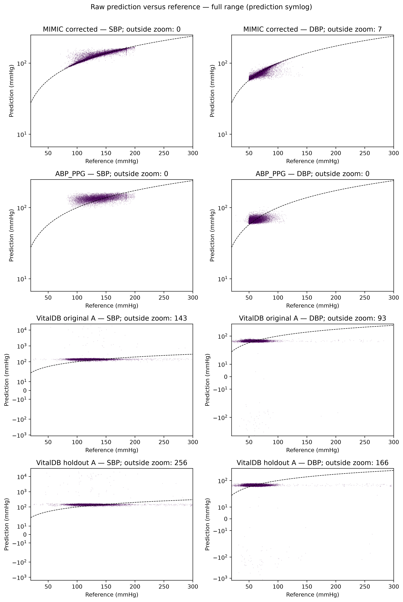
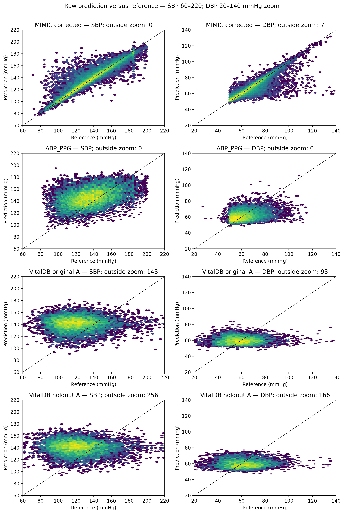
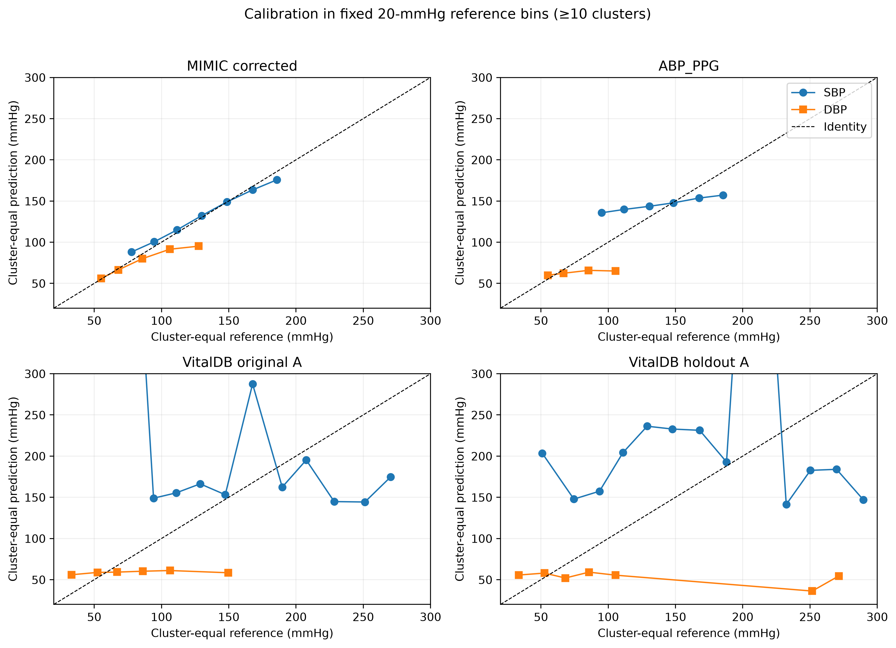
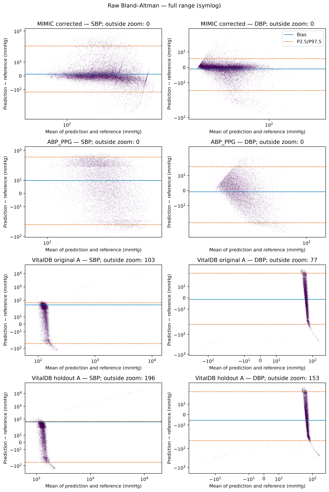
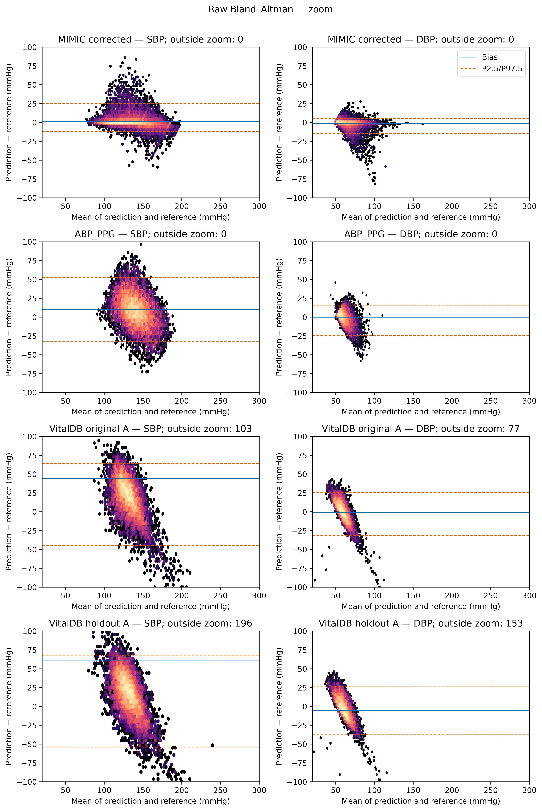
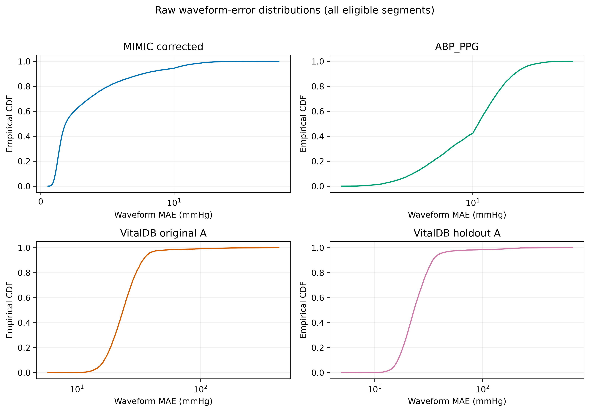

# Расширенные материалы к ревизии статьи PPG2ABP

## Назначение

Этот публичный файл содержит дополнительную детализацию анализа, которая поддерживает воспроизводимость, но не требуется для понимания основных выводов статьи. Он не является официальным приложением журнала и не заменяет рукопись или отдельный ответ рецензентам.

Для зафиксированной публичной версии используется тег `revision-v2`: страница release — https://github.com/kma-art/PPG2ABP_Evaluation/releases/tag/revision-v2, файл — https://github.com/kma-art/PPG2ABP_Evaluation/blob/revision-v2/article_revision_extended_materials.md. Публикацию тега и release выполняет владелец репозитория; до публикации эти адреса могут возвращать ошибку 404.

## S1 Состав выборок и протокол

### S1.1 Состав выборок

| Набор | Роль | Исходных сущностей | Кластеров | Сегментов в оценке | Исключено на входе | Исключено при кластеризации |
|---|---|---|---:|---:|---:|---:|
| MIMIC-III (оригинальный тест) | основной | 127 260 строк набора | 7 353 | 27 260 | 0 | 92 |
| ABP_PPG | основной | 11 708 сегментов | 1 716 | 11 706 | 2 | 0 |
| VitalDB, первоначальная | основной (исследовательский выбор нормализации) | 100 случаев | 94 | 9 400 | 0 | 0 |
| VitalDB, независимая (нормализация A) | подтверждающий анализ | 100 случаев | 96 | 9 600 | 0 | 0 |
| VitalDB, независимая (нормализация B) | вторичный анализ | 100 случаев | 96 | 9 600 | 0 | 0 |
| VitalDB, независимая (нормализация C) | вторичный анализ | 100 случаев | 96 | 9 600 | 0 | 0 |

*Примечание.* Кластер — исходная запись MIMIC-III либо случай VitalDB. Для MIMIC-III 92 сегмента не отнесены однозначно к записи, поэтому анализ с равным весом кластеров включает 27 168 сегментов / 7 353 записи; в анализе с равным весом сегментов сохранены все 27 260 сегментов. Из 11 708 сегментов ABP_PPG два исключены из-за отрицательных значений АД. Варианты A, B и C для независимой выборки VitalDB — один и тот же набор сигналов при трёх стратегиях нормализации.

Источник: `codes/tables/revision_v2/point6/dataset_composition.md`.

### S1.2 Независимость оригинального тестового набора MIMIC-III

Ниже приведены результаты проверки, выполненной по файлам, опубликованным авторами модели. Все использованные материалы общедоступны, поэтому проверка воспроизводима сторонним читателем. Изложены только измеренные свойства этих файлов; сведений о том, какие данные использовались при обучении опубликованных весов, в сопроводительных материалах нет, и предположения об этом здесь не делаются.

**Исходные материалы.** Файл `data.hdf5`, ссылка на который приведена в `codes/README.md` и в вводной ячейке ноутбука `codes/PPG2ABP.ipynb` репозитория авторов, содержит 127 260 сегментов формы (2, 1250): канал АД и канал ФПГ. Скрипт `data_handling.py` из того же репозитория делит набор по номеру строки: строки 0–99 999 отводятся под обучение и валидацию, строки 100 000–127 259 образуют тестовую часть из 27 260 сегментов. Функция `fold_data()` не содержит перемешивания и не обращается к генератору случайных чисел, поэтому при заданном файле разбиение определено однозначно. Указанный файл является единственным входом этого скрипта, а его выход — единственным входом обучающего скрипта `train_models.py`.

**Повторяющиеся сегменты.** Для каждой строки вычислен SHA-256 конкатенации обоих каналов. Различных сегментов 78 898; из них 30 585 встречаются один раз, 48 287 — дважды, 3 — трижды, 23 — четырежды. Повторы затрагивают 96 675 из 127 260 строк; лишних копий сверх первой — 48 362, то есть 38 % строк.

**Пересечение частей.** Из 27 260 сегментов тестовой части **16 265 (59,7 %) имеют побайтовую копию среди строк 0–99 999**. Результат идентичен при сравнении по первым 1 024 отсчётам (длина входа модели) и по всем 1 250 отсчётам, то есть совпадают целые эпизоды, а не только их начальные фрагменты. Доля не зависит от варианта кросс-валидации: строки 0–99 999 при любом значении `fold_id` целиком отводятся под обучение и валидацию, меняется лишь граница между ними. Число тестовых сегментов, имеющих копию в обучающей части, по десяти вариантам составляло 14 574–14 698 (53,5–53,9 %), в валидационной — 1 571–1 697 (5,8–6,2 %). Это два независимых счётчика, а не разбиение числа 16 265: сегмент, встречающийся более двух раз, может иметь копии в обеих частях одновременно.

Выборочная побайтовая проверка подтвердила совпадение в 6 из 6 проверенных пар; контрольное сравнение 6 случайно выбранных пар «строка из первых 100 000 — строка тестовой части» дало 0 совпадений.

**Соответствующий фрагмент кода.** Отбор эпизодов в функции `downsample_data()` файла `data_processing.py` выполняется в два прохода. На первом, по значениям ДАД, отобранные эпизоды заносятся в результирующий список и одновременно регистрируются в таблице. На втором, по значениям САД, обращение к этой таблице заключено в блок `try`/`except`: при возникновении исключения, то есть при отсутствии эпизода в таблице, кандидат отбрасывается, а при успешном обращении, то есть при наличии эпизода в таблице, добавляется в список. Поскольку таблица содержит результаты первого прохода, второй проход добавляет только повторные вхождения, а максимальная кратность равна двум.

**Согласованность с опубликованным промежуточным файлом.** Файл `candidates.p`, ссылка на который приведена в ноутбуке авторов, содержит перечень отобранных эпизодов в виде 127 260 записей «номер файла, номер записи, начало эпизода». Его структура точно соответствует описанному порядку отбора: первые 78 926 записей попарно различны и совпадают по числу с количеством различных записей во всём файле, а все последующие 48 334 записи без исключения повторяют одну из первых; повторов внутри каждой из двух частей нет, максимальная кратность равна двум. Различие между 78 926 различными записями `candidates.p` и 78 898 различными по содержимому сегментами `data.hdf5` объясняет наблюдаемую кратность выше двух: отдельные разные записи дают побайтово одинаковые сегменты. При такой структуре и доле тестовой части 27 260 / 127 260 ожидаемое число тестовых сегментов, имеющих копию вне тестовой части, равно $2 \times 48\,334 \times 0{,}2142 \times 0{,}7858 = 16\,271$; измеренное значение 16 265 отличается на 0,04 %. Поскольку функция `merge_episodes()` перемешивает эпизоды случайным образом, а `fold_data()` делит результат по номеру строки, указанная доля является ожидаемой для любого набора, собранного этим порядком отбора из данного файла `candidates.p`, а не свойством конкретного экземпляра `data.hdf5`.

**Соответствие анализируемого файла авторским параметрам нормализации.** Минимальные и максимальные значения обоих каналов, вычисленные по строкам 0–99 999, совпадают до последнего разряда со значениями из опубликованного авторами файла `meta9.p`: $\min_{\text{АД}} = 50$, $\max_{\text{АД}} = 199{,}98749589709124$, $\min_{\text{ФПГ}} = 0$, $\max_{\text{ФПГ}} = 4{,}001955034213099$. Повторная загрузка `data.hdf5` по той же ссылке дала файл с той же контрольной суммой SHA-256 и теми же результатами.

**Дополнительная проверка на уровне исходных записей.** Сопоставление сегментов с записями MIMIC-III, выполненное в настоящей работе, показало, что 7 144 из 7 353 записей, представленных в тестовой части, встречаются также среди строк, отводимых под обучение. В отличие от предыдущих пунктов, эта проверка опирается на собственную реконструкцию соответствия сегментов записям, а не только на чтение опубликованных файлов.

**Интерпретация.** В сопроводительных материалах оригинальной работы оставшиеся 27 260 эпизодов описаны как независимый тестовый набор. Приведённые измерения показывают, что это не так: 59,7 % сегментов этой части имеют побайтовую копию среди строк, которые авторский же скрипт разбиения отводит под обучение и валидацию. Пересечение является измеренным свойством опубликованных файлов и не опирается на предположения о ходе обучения.

Отдельный вопрос — какому из десяти вариантов разбиения соответствуют опубликованные веса: авторы его не указывают, и по доступным материалам установить это невозможно. Независимости тестовой части эта неопределённость не восстанавливает, поскольку доля пересечения от варианта не зависит: копию именно в обучающей части имеют не менее 53,5 % тестовых сегментов при любом значении `fold_id`. Соответственно, полученные на этом наборе в настоящей работе показатели, включая MAE формы волны 3,680 мм рт. ст., интерпретируются как внутридоменный тест воспроизводимости и оптимистичная граница достижимой точности. На основной вывод работы это не влияет: при поправке на это обстоятельство наблюдаемое ухудшение при переходе к ABP_PPG и VitalDB может оказаться только меньше заявленного, но не больше.

### S1.3 Протокол формирования выборок VitalDB

Обе выборки VitalDB получены через открытый API и обработаны одним и тем же конвейером. Отправной точкой служил список случаев, содержащих одновременно треки `SNUADC/PLETH` и `SNUADC/ART`; на момент отбора независимой выборки он насчитывал 3 459 случаев.

**Отбор случаев.** Первоначальную выборку составили первые 100 случаев этого списка в порядке его выдачи. Это прагматическое правило удобной выборки: оно применялось до инференса и не зависело от значений АД или ошибок модели, но не является случайным или клинически стратифицированным отбором и допускает смещение, связанное с порядком случаев в списке. Независимая выборка сформирована позднее по тому же правилу с двумя дополнительными условиями: из рассмотрения исключены первые 100 случаев и все соответствующие им субъекты, а каждый новый субъект представлен ровно одним случаем. В обеих выборках все 100 случаев загружены успешно, а случаи, не давшие ни одного допустимого сегмента, не заменялись; поэтому в первоначальной выборке представлены 94 случая и 94 субъекта, в независимой — 96 случаев и 96 субъектов.

**Приведение частоты и нарезка.** Нативная частота обоих треков — 500 Гц. Сигналы децимированы до 125 Гц КИХ-фильтром с нулевой фазой (коэффициент 4) и нарезаны скользящими окнами по 1 024 отсчёта с шагом 512 отсчётов, то есть с перекрытием 50 %.

**Критерии допустимости сегмента.** Окно отбрасывалось, если доля пропущенных значений превышала 10 % хотя бы в одном из двух каналов; если стандартное отклонение любого из каналов было ниже $10^{-6}$, что соответствует постоянному сигналу; либо если референсное АД выходило за диапазон 20–300 мм рт. ст. В принятых окнах оставшиеся пропуски восстанавливались линейной интерполяцией. Здесь этот диапазон служит критерием качества входных данных; в S6 тот же интервал применяется к выходу модели и относится к анализу чувствительности, не связанному с настоящим отбором.

**Ограничение числа сегментов на случай.** Из каждого случая брали не более 100 допустимых окон, а при большем числе выбирали 100 случайно без возвращения; в первоначальной выборке до этого ограничения насчитывалось 295 072 допустимых окна. Ограничение достигнуто во всех представленных случаях обеих выборок, поэтому итоговые объёмы равны 94 × 100 = 9 400 и 96 × 100 = 9 600 сегментов. Для независимой выборки отбор воспроизводим: зерно генератора для случая получено как первые восемь шестнадцатеричных разрядов SHA-256 от строки `20260908:<номер случая>`. Для первоначальной выборки зерно не фиксировалось; аудит происхождения впоследствии сопоставил все 9 400 сохранённых сегментов с допустимыми окнами исходных сигналов однозначно и без остатка, восстановив для каждого сегмента случай и положение в записи.

Источники: `revision_v2/point4/protocol_v1.json`, `revision_v2/point4/core.py`.

## S2 Нормализация VitalDB

На первоначальной выборке VitalDB исследовательски сопоставлялись три варианта нормализации:

- **A — global min-max:** $X_{\text{norm}}=(X-a)/(b-a)$, где $a=-16{,}80837555484424$, $b=96{,}87874678552862$;
- **B — параметры MIMIC-III:** $X_{\text{norm}}=X/4{,}001955034213099$;
- **C — перцентильное преобразование:** $X_{\text{norm}}=(X-P_1)/(P_{99}-P_1)$, где $P_1=0{,}8139579029352338$, $P_{99}=66{,}95604975066223$, с последующим ограничением диапазоном [−0,1; 1,1].

По MAE формы волны на первоначальной выборке был выбран вариант A. Поэтому результаты этой выборки рассматриваются как исследовательские, а не как независимая оценка выбранной стратегии.

До загрузки сигналов независимой выборки были зафиксированы вариант A, его числовые параметры, протокол отбора и правила обработки данных. Протокол формирования обеих выборок — исключение первых 100 случаев и соответствующих им субъектов, правило одного случая на субъект и зерно отбора сегментов — приведён в S1.3; итоговая независимая выборка содержала 9 600 сегментов из 96 случаев, относящихся к 96 различным субъектам. Параметры нормализации по ней не переоценивались.

Вариант A являлся единственным подтверждающим анализом. Варианты B и C были заранее предусмотрены как вторичный абляционный анализ и не использовались для повторного выбора стратегии. Во всех вариантах применялась денормализация $y=y_{\text{norm}}\times149{,}98749589709124+50$.

Результаты представлены как средняя ошибка с равным весом субъектов и 95 % кластерный бутстраповский доверительный интервал, мм рт. ст.; использовано 10 000 бутстраповских выборок.

| Вариант | MAE формы волны | Ошибка САД | Ошибка ДАД | Ошибка АДср |
|---|---:|---:|---:|---:|
| A, подтверждающий | 27,054 [25,548; 28,871] | 73,906 [45,008; 113,555] | 14,937 [13,124; 17,220] | 16,706 [15,194; 18,448] |
| B, вторичный | 72,608 [67,640; 78,163] | 682,809 [405,169; 1 000,231] | 42,402 [33,436; 53,530] | 68,794 [63,875; 74,293] |
| C, вторичный | 39,063 [26,827; 62,105] | 46,492 [27,522; 81,965] | 52,926 [16,373; 120,494] | 28,008 [16,058; 50,471] |

Вариант A не показал меньшую ошибку по каждой отдельной скалярной метрике: в частности, средняя ошибка САД была ниже при варианте C. Поэтому вторичный анализ не интерпретируется как доказательство универсального превосходства A. Независимая проверка варианта A предназначена для оценки заранее выбранной стратегии и подтверждает сохранение выраженного доменного разрыва.

Источник: `codes/tables/revision_v2/point6/normalization_holdout.md`.

## S3 Основные метрики и способы усреднения

Ниже $\hat{y}_i$ и $y_i$ — предсказанная и эталонная формы волны сегмента $i$, каждая длиной $L=1\,024$ отсчёта и выраженная в мм рт. ст. после денормализации по S2. Для сегмента рассчитывали четыре показателя:

$$\mathrm{MAE}_i=\frac{1}{L}\sum_{t=1}^{L}\bigl|\hat{y}_{i,t}-y_{i,t}\bigr|,$$

$$e^{\text{САД}}_i=\bigl|\max_t\hat{y}_{i,t}-\max_t y_{i,t}\bigr|,\qquad e^{\text{ДАД}}_i=\bigl|\min_t\hat{y}_{i,t}-\min_t y_{i,t}\bigr|,\qquad e^{\text{АДср}}_i=\bigl|\overline{\hat{y}_i}-\overline{y_i}\bigr|,$$

где $\overline{\hat{y}_i}$ и $\overline{y_i}$ — средние по 1 024 отсчётам. Знаковую ошибку определяли теми же выражениями без взятия модуля, как «предсказание − эталон»; например, $s^{\text{САД}}_i=\max_t\hat{y}_{i,t}-\max_t y_{i,t}$.

Пусть $m_i$ — любой из перечисленных показателей сегмента, $C$ — число кластеров, $n_c$ — число сегментов кластера $c$. Основная оценка с равным весом кластеров (cluster-equal estimand) равна

$$\bar{m}_{\text{cluster}}=\frac{1}{C}\sum_{c=1}^{C}\bar{m}_c,\qquad \bar{m}_c=\frac{1}{n_c}\sum_{i\in c}m_i,$$

а дополнительная оценка с равным весом сегментов (segment-weighted) — среднему по всем $N$ сегментам выборки, $\bar{m}_{\text{segment}}=\frac{1}{N}\sum_{i=1}^{N}m_i$. Для MIMIC-III эти две оценки опираются на разные множества сегментов: кластерная — на 27 168 сегментов с установленной принадлежностью записи, сегментная — на все 27 260. Приводимое далее SD — стандартное отклонение кластерных средних $\bar{m}_c$ для первой оценки и отдельных значений $m_i$ для второй.

Доли ошибок в S5 рассчитаны по той же кластерной схеме с заменой $m_i$ на индикатор $\mathbf{1}[m_i\le\theta]$, где порог $\theta$ равен 5, 10 и 15 мм рт. ст. Доверительные интервалы получали бутстрапом целых кластеров: 10 000 раз выбирали $C$ кластеров с возвращением, каждый раз пересчитывали $\bar{m}_{\text{cluster}}$ и брали 2,5-й и 97,5-й перцентили полученного распределения.

Основным способом усреднения являлась оценка с равным весом кластеров: ошибки сначала усредняли внутри каждого кластера, а затем — между кластерами. Для ABP_PPG и VitalDB кластер соответствовал субъекту, для MIMIC-III — исходной записи. Результаты представлены как среднее ± SD кластерных средних [95 % ДИ], мм рт. ст.

| Выборка | Сегменты / кластеры | MAE формы волны | Ошибка САД | Ошибка ДАД | Ошибка АДср |
|---|---:|---:|---:|---:|---:|
| MIMIC-III | 27 168 / 7 353 | 3,680 ± 3,486 [3,601; 3,761] | 4,544 ± 5,773 [4,415; 4,680] | 2,618 ± 3,854 [2,532; 2,707] | 1,881 ± 3,023 [1,814; 1,953] |
| ABP_PPG | 11 706 / 1 716 | 12,544 ± 5,127 [12,298; 12,794] | 18,762 ± 11,389 [18,228; 19,316] | 7,503 ± 5,259 [7,255; 7,757] | 9,453 ± 6,084 [9,168; 9,744] |
| VitalDB, первоначальная | 9 400 / 94 | 25,921 ± 4,965 [24,913; 26,939] | 52,971 ± 112,078 [34,708; 78,710] | 12,321 ± 5,927 [11,189; 13,578] | 15,128 ± 5,867 [13,964; 16,380] |
| VitalDB, независимая | 9 600 / 96 | 27,054 ± 8,199 [25,548; 28,871] | 73,906 ± 175,450 [45,008; 113,555] | 14,937 ± 10,170 [13,124; 17,220] | 16,706 ± 8,061 [15,194; 18,448] |

Для сопоставимости с исходным представлением дополнительно рассчитаны показатели с равным весом отдельных сегментов. Доверительные интервалы для них не приводятся, поскольку отдельные сегменты одного субъекта или записи не являются независимыми.

| Выборка | Сегменты | MAE формы волны | Ошибка САД | Ошибка ДАД | Ошибка АДср |
|---|---:|---:|---:|---:|---:|
| MIMIC-III | 27 260 | 3,452 ± 3,782 | 4,296 ± 6,879 | 2,586 ± 4,614 | 1,729 ± 3,327 |
| ABP_PPG | 11 706 | 12,375 ± 6,325 | 18,272 ± 14,096 | 7,549 ± 6,719 | 9,386 ± 7,480 |
| VitalDB, первоначальная | 9 400 | 25,921 ± 16,605 | 52,971 ± 562,643 | 12,321 ± 21,458 | 15,128 ± 16,932 |
| VitalDB, независимая | 9 600 | 27,054 ± 24,085 | 73,906 ± 777,681 | 14,937 ± 31,583 | 16,706 ± 23,219 |

Знаковую ошибку рассчитывали как «предсказание − эталон»: положительное значение соответствует завышению, отрицательное — занижению. Ниже приведены знаковые ошибки с равным весом кластеров.

| Выборка | САД | ДАД | АДср |
|---|---:|---:|---:|
| MIMIC-III | 1,275 ± 6,892 [1,119; 1,435] | −1,018 ± 4,356 [−1,119; −0,918] | −0,405 ± 3,455 [−0,484; −0,326] |
| ABP_PPG | 9,795 ± 18,453 [8,896; 10,669] | −0,837 ± 8,514 [−1,239; −0,431] | 2,750 ± 10,281 [2,258; 3,244] |
| VitalDB, первоначальная | 43,830 ± 113,104 [25,298; 69,777] | −1,300 ± 10,219 [−3,366; 0,716] | 3,597 ± 11,720 [1,215; 5,979] |
| VitalDB, независимая | 61,486 ± 175,749 [32,509; 101,310] | −5,502 ± 11,888 [−8,010; −3,165] | 0,249 ± 11,976 [−2,214; 2,615] |

Дополнительные знаковые ошибки с равным весом сегментов:

| Выборка | САД | ДАД | АДср |
|---|---:|---:|---:|
| MIMIC-III | 1,210 ± 8,020 | −1,216 ± 5,148 | −0,464 ± 3,720 |
| ABP_PPG | 8,527 ± 21,445 | −1,253 ± 10,028 | 2,038 ± 11,827 |
| VitalDB, первоначальная | 43,830 ± 563,428 | −1,300 ± 24,710 | 3,597 ± 22,419 |
| VitalDB, независимая | 61,486 ± 778,761 | −5,502 ± 34,501 | 0,249 ± 28,604 |

Источники:

- `codes/tables/revision_v2/point6/main_metrics.md`;
- `codes/tables/revision_v2/point6/signed_errors.md`.

## S4 Междоменные сравнения

Сравнения выполнялись по кластерным средним. Разность рассчитана как ошибка на независимой выборке VitalDB минус ошибка на выборке сравнения; положительное значение указывает на более высокую ошибку VitalDB. В таблице приведены разность средних [95 % ДИ], $\delta$ Клиффа и скорректированное методом Холма значение $p$ двустороннего U-критерия Манна–Уитни.

| Выборка сравнения | Метрика | Разность [95 % ДИ], мм рт. ст. | $\delta$ Клиффа | $p_{\text{Holm}}$ |
|---|---|---:|---:|---:|
| MIMIC-III | MAE формы волны | 23,374 [21,884; 25,143] | 0,994 | $4{,}50\times10^{-62}$ |
| MIMIC-III | Ошибка САД | 69,362 [40,077; 110,718] | 0,971 | $1{,}76\times10^{-59}$ |
| MIMIC-III | Ошибка ДАД | 12,319 [10,466; 14,572] | 0,937 | $1{,}63\times10^{-55}$ |
| MIMIC-III | Ошибка АДср | 14,825 [13,318; 16,558] | 0,974 | $8{,}62\times10^{-60}$ |
| ABP_PPG | MAE формы волны | 14,510 [12,984; 16,306] | 0,933 | $5{,}54\times10^{-53}$ |
| ABP_PPG | Ошибка САД | 55,145 [26,056; 94,597] | 0,603 | $2{,}25\times10^{-23}$ |
| ABP_PPG | Ошибка ДАД | 7,434 [5,584; 9,644] | 0,656 | $7{,}20\times10^{-27}$ |
| ABP_PPG | Ошибка АДср | 7,253 [5,732; 8,980] | 0,627 | $8{,}94\times10^{-25}$ |

Во всех восьми сравнениях доверительные интервалы разностей не включали ноль, а скорректированные значения $p$ были меньше 0,05. Положительные значения $\delta$ Клиффа показывают, что распределения кластерных средних ошибок на независимой выборке VitalDB были смещены в сторону больших значений.

Статистический тест между MIMIC-III и ABP_PPG не выполнялся из-за невозможности исключить пересечение пациентов и отсутствия идентификаторов пациентов в MIMIC-III. Описательная разность кластерных средних ABP_PPG минус MIMIC-III составляла 8,864 мм рт. ст. для MAE формы волны, 14,218 мм рт. ст. для САД, 4,884 мм рт. ст. для ДАД и 7,572 мм рт. ст. для АДср.

Источники:

- `codes/tables/revision_v2/point6/normalization_holdout.md`;
- `codes/tables/revision_v2/point6/main_metrics.md`.

## S5 Пороговые показатели

Показатели рассчитаны по исходным предсказаниям без постобработки в корректной физической шкале. Доли ошибок сначала определяли внутри каждого кластера, затем усредняли с равным весом кластеров. Для ABP_PPG и VitalDB кластер соответствовал субъекту, для MIMIC-III — исходной записи. Результаты представлены как средняя доля [95 % кластерный бутстраповский ДИ], %.

| Выборка | Метрика | Ошибка ≤5 мм рт. ст. | Ошибка ≤10 мм рт. ст. | Ошибка ≤15 мм рт. ст. | Грейд BHS |
|---|---|---:|---:|---:|:---:|
| MIMIC-III | САД | 76,573 [75,815; 77,313] | 88,292 [87,712; 88,856] | 92,918 [92,430; 93,382] | B |
| MIMIC-III | ДАД | 87,244 [86,636; 87,838] | 95,101 [94,716; 95,479] | 97,343 [97,043; 97,630] | A |
| MIMIC-III | АДср | 89,705 [89,131; 90,265] | 96,511 [96,158; 96,844] | 98,476 [98,233; 98,705] | A |
| ABP_PPG | САД | 16,693 [15,636; 17,763] | 32,840 [31,359; 34,320] | 48,579 [46,874; 50,235] | D |
| ABP_PPG | ДАД | 43,846 [42,241; 45,465] | 73,199 [71,651; 74,755] | 88,484 [87,367; 89,578] | C |
| ABP_PPG | АДср | 34,365 [32,745; 35,951] | 60,590 [58,888; 62,319] | 79,399 [77,947; 80,826] | D |
| VitalDB, первоначальная | САД | 9,798 [8,340; 11,309] | 19,872 [17,255; 22,553] | 29,681 [26,213; 33,266] | D |
| VitalDB, первоначальная | ДАД | 29,372 [26,053; 32,702] | 54,032 [49,361; 58,617] | 73,819 [69,766; 77,553] | D |
| VitalDB, первоначальная | АДср | 21,670 [18,872; 24,532] | 42,617 [38,223; 46,958] | 59,872 [55,106; 64,426] | D |
| VitalDB, независимая | САД | 10,948 [9,500; 12,438] | 21,646 [19,240; 24,146] | 31,917 [28,771; 35,167] | D |
| VitalDB, независимая | ДАД | 27,125 [24,063; 30,240] | 49,542 [45,135; 53,907] | 67,958 [63,729; 72,000] | D |
| VitalDB, независимая | АДср | 20,750 [18,417; 23,229] | 40,927 [37,166; 44,833] | 58,313 [54,094; 62,479] | D |

Грейд определяли по одновременному выполнению трёх порогов: A — не менее 60/85/95 %, B — 50/75/90 %, C — 40/65/85 %; показатели ниже порогов грейда C относили к грейду D.

Полные значения ME ± SD для сопоставления с числовыми критериями AAMI приведены в S3. Соответствующие им результаты:

| Выборка | САД | ДАД | АДср |
|---|:---:|:---:|:---:|
| MIMIC-III | Выполнены | Выполнены | Выполнены |
| ABP_PPG | Не выполнены | Не выполнен порог SD | Не выполнен порог SD |
| VitalDB, первоначальная | Не выполнены | Не выполнен порог SD | Не выполнен порог SD |
| VitalDB, независимая | Не выполнены | Не выполнены | Не выполнен порог SD |

«Выполнены» означает выполнение обоих числовых порогов: |ME| ≤5 мм рт. ст. и SD ≤8 мм рт. ст. «Не выполнен порог SD» означает превышение только порога SD, «Не выполнены» — превышение порога ME либо обоих порогов. Показатели представляют собой описательные характеристики алгоритма, сопоставленные с числовыми порогами BHS и AAMI, и не являются клинической или сертификационной валидацией медицинского изделия.

Источники:

- `codes/tables/revision_v2/point6/bhs_proportions.md`;
- `codes/tables/revision_v2/point6/signed_errors.md`.

## S6 Выбросы и постобработка

Основным являлся анализ исходных предсказаний без постобработки: в него включали все сегменты, прошедшие первоначальные критерии качества входных данных. Дополнительно применяли два не использующих истинное АД варианта обработки:

- ограничение каждой предсказанной точки диапазоном 20–300 мм рт. ст.;
- отказ от результата для всего сегмента, если хотя бы одна предсказанная точка выходила за этот диапазон.

Число событий выхода предсказаний за диапазон до постобработки:

| Выборка | Сегменты с выходом | Затронутые кластеры | Точки вне диапазона |
|---|---:|---:|---:|
| MIMIC-III | 0 | 0 | 0 |
| ABP_PPG | 0 | 0 | 0 |
| VitalDB, первоначальная | 44 | 13 | 11 086 |
| VitalDB, независимая | 69 | 15 | 17 454 |

### S6.1 Анализ чувствительности

В таблице приведены средние ошибки с равным весом кластеров, мм рт. ст. Покрытие соответствует доле сохранённых сегментов. Во всех вариантах сохранялись все исходно представленные кластеры.

| Выборка | Обработка | Сегменты / кластеры | Покрытие | MAE формы волны | Ошибка САД | Ошибка ДАД | Ошибка АДср |
|---|---|---:|---:|---:|---:|---:|---:|
| MIMIC-III | Без постобработки | 27 168 / 7 353 | 100 % | 3,680 | 4,544 | 2,618 | 1,881 |
| MIMIC-III | Ограничение 20–300 | 27 168 / 7 353 | 100 % | 3,680 | 4,544 | 2,618 | 1,881 |
| MIMIC-III | Отказ вне 20–300 | 27 168 / 7 353 | 100 % | 3,680 | 4,544 | 2,618 | 1,881 |
| ABP_PPG | Без постобработки | 11 706 / 1 716 | 100 % | 12,544 | 18,762 | 7,503 | 9,453 |
| ABP_PPG | Ограничение 20–300 | 11 706 / 1 716 | 100 % | 12,544 | 18,762 | 7,503 | 9,453 |
| ABP_PPG | Отказ вне 20–300 | 11 706 / 1 716 | 100 % | 12,544 | 18,762 | 7,503 | 9,453 |
| VitalDB, первоначальная | Без постобработки | 9 400 / 94 | 100 % | 25,921 | 52,971 | 12,321 | 15,128 |
| VitalDB, первоначальная | Ограничение 20–300 | 9 400 / 94 | 100 % | 25,499 | 27,824 | 11,504 | 14,813 |
| VitalDB, первоначальная | Отказ вне 20–300 | 9 356 / 94 | 99,5 % | 25,293 | 27,193 | 11,329 | 14,741 |
| VitalDB, независимая | Без постобработки | 9 600 / 96 | 100 % | 27,054 | 73,906 | 14,937 | 16,706 |
| VitalDB, независимая | Ограничение 20–300 | 9 600 / 96 | 100 % | 26,314 | 28,483 | 13,616 | 16,199 |
| VitalDB, независимая | Отказ вне 20–300 | 9 531 / 96 | 99,3 % | 26,025 | 27,622 | 13,296 | 16,130 |

На MIMIC-III и ABP_PPG оба варианта обработки не изменяли результаты. На обеих выборках VitalDB наибольшее изменение наблюдалось для САД. При этом ошибки формы волны, ДАД и АДср оставались повышенными, поэтому вывод о выраженном снижении точности модели на VitalDB сохранялся.

*Примечание к знаменателю MIMIC-III.* Таблица анализа чувствительности (S6.1) относится к оценке с равным весом кластеров и поэтому содержит 27 168 однозначно кластеризованных сегментов / 7 353 записи. Все 27 260 сегментов, включая 92 без однозначной привязки к записи, сохранены в анализе с равным весом сегментов (S3) и в сегментных хвостовых характеристиках S6.2.

### S6.2 Робастные и хвостовые характеристики

Показатели ниже рассчитаны на уровне отдельных сегментов для исходных предсказаний без постобработки. Все значения ошибок приведены в мм рт. ст.; последние пять столбцов содержат число сегментов с ошибкой выше соответствующего порога.

| Выборка | Метрика | Медиана [Q1; Q3] | P95 | Максимум | >30 | >50 | >100 | >200 | >500 |
|---|---|---:|---:|---:|---:|---:|---:|---:|---:|
| MIMIC-III | MAE формы волны | 1,857 [1,325; 4,259] | 10,476 | 74,562 | 47 | 7 | 0 | 0 | 0 |
| MIMIC-III | Ошибка САД | 1,995 [0,866; 4,418] | 17,217 | 86,228 | 443 | 72 | 0 | 0 | 0 |
| MIMIC-III | Ошибка ДАД | 1,138 [0,497; 2,558] | 10,164 | 81,184 | 138 | 20 | 0 | 0 | 0 |
| MIMIC-III | Ошибка АДср | 0,589 [0,248; 1,659] | 7,338 | 74,562 | 42 | 7 | 0 | 0 | 0 |
| ABP_PPG | MAE формы волны | 10,988 [7,897; 15,395] | 24,398 | 56,494 | 231 | 4 | 0 | 0 | 0 |
| ABP_PPG | Ошибка САД | 15,198 [7,275; 26,076] | 45,670 | 96,716 | 2 235 | 388 | 0 | 0 | 0 |
| ABP_PPG | Ошибка ДАД | 5,820 [2,689; 10,403] | 20,464 | 58,167 | 140 | 8 | 0 | 0 | 0 |
| ABP_PPG | Ошибка АДср | 7,679 [3,567; 13,475] | 23,504 | 56,494 | 220 | 4 | 0 | 0 | 0 |
| VitalDB, первоначальная | MAE формы волны | 23,603 [19,470; 28,629] | 37,737 | 428,034 | 1 912 | 183 | 77 | 13 | 0 |
| VitalDB, первоначальная | Ошибка САД | 24,768 [12,751; 38,419] | 60,505 | 22 952,746 | 3 733 | 1 073 | 103 | 42 | 38 |
| VitalDB, первоначальная | Ошибка ДАД | 9,022 [4,228; 15,323] | 27,684 | 680,144 | 360 | 112 | 75 | 23 | 2 |
| VitalDB, первоначальная | Ошибка АДср | 11,955 [5,775; 20,419] | 34,578 | 371,448 | 833 | 155 | 63 | 8 | 0 |
| VitalDB, независимая | MAE формы волны | 23,083 [19,046; 28,707] | 39,880 | 678,676 | 2 004 | 269 | 155 | 43 | 4 |
| VitalDB, независимая | Ошибка САД | 23,708 [11,632; 38,822] | 64,713 | 32 109,383 | 3 653 | 1 222 | 196 | 64 | 61 |
| VitalDB, независимая | Ошибка ДАД | 10,118 [4,539; 17,155] | 30,593 | 1 254,921 | 513 | 185 | 148 | 77 | 5 |
| VitalDB, независимая | Ошибка АДср | 12,464 [6,031; 20,779] | 36,472 | 559,784 | 943 | 242 | 137 | 28 | 2 |

Медианы и межквартильные интервалы показывают, что выраженное ухудшение на VitalDB сохранялось и при использовании робастных характеристик. Одновременно различие между медианой ошибки САД и её средним значением отражает сильное влияние редкого правого хвоста на среднее.

### S6.3 Диагностические анализы с использованием истинного АД

Дополнительно были выполнены два анализа, использующие эталонные значения:

- исключение 5 % сегментов с наибольшей исходной MAE формы волны;
- исключение сегментов, в которых истинное АД выходило за диапазон [50; 200] мм рт. ст.

Эти правила неприменимы при эксплуатации модели и не рассматриваются как варианты постобработки. В таблице приведены средние ошибки с равным весом кластеров, мм рт. ст.

| Выборка | Диагностический сценарий | Сегменты / кластеры | MAE формы волны | Ошибка САД | Ошибка ДАД | Ошибка АДср |
|---|---|---:|---:|---:|---:|---:|
| MIMIC-III | Исключение 5 % наибольших MAE | 25 897 / 7 120 | 2,893 | 3,742 | 1,994 | 1,229 |
| MIMIC-III | Истинное АД в [50; 200] | 27 168 / 7 353 | 3,680 | 4,544 | 2,618 | 1,881 |
| ABP_PPG | Исключение 5 % наибольших MAE | 11 120 / 1 688 | 11,785 | 17,870 | 6,930 | 8,621 |
| ABP_PPG | Истинное АД в [50; 200] | 11 510 / 1 713 | 12,516 | 18,734 | 7,436 | 9,417 |
| VitalDB, первоначальная | Исключение 5 % наибольших MAE | 8 930 / 94 | 23,789 | 25,621 | 10,100 | 12,981 |
| VitalDB, первоначальная | Истинное АД в [50; 200] | 7 129 / 94 | 23,772 | 47,511 | 9,668 | 11,740 |
| VitalDB, независимая | Исключение 5 % наибольших MAE | 9 120 / 96 | 23,611 | 25,542 | 11,153 | 13,420 |
| VitalDB, независимая | Истинное АД в [50; 200] | 7 649 / 96 | 24,810 | 90,394 | 12,543 | 12,916 |

Отдельный аудит показал, что использованное ранее значение 22,25 ± 5,78 мм рт. ст. объединяло среднее и SD из разных подмножеств. Для первоначальной выборки VitalDB корректные сегментные значения MAE формы волны составляли:

- 23,697 ± 5,783 мм рт. ст. после исключения 5 % наибольших ошибок (8 930 сегментов);
- 23,293 ± 12,857 мм рт. ст. при ограничении по истинному АД (7 129 сегментов);
- 22,246 ± 5,098 мм рт. ст. для пересечения этих условий (6 976 сегментов, только аудит).

Ни одно из этих подмножеств не использовалось для расчёта основных результатов.

Источники:

- `codes/tables/revision_v2/point6/postprocessing.md`;
- `codes/tables/revision_v2/point6/robust_tails.md`;
- `codes/tables/revision_v2/point6/legacy_audits.md`.

## S7 Корреляция, калибровка и согласие

Анализ выполнен для исходных предсказаний без постобработки. Для корреляции и линейной калибровки эталонные и предсказанные значения сначала усредняли внутри каждого кластера. Для ABP_PPG и VitalDB кластер соответствовал субъекту, для MIMIC-III — исходной записи. Рассчитывали коэффициенты корреляции Пирсона и Спирмена, $R^2$, наклон и свободный член линейной зависимости «предсказание = наклон × эталон + свободный член». 95 % ДИ получали по 10 000 бутстраповским выборкам кластерных пар; при бутстрапе коэффициента Спирмена использовали ранги, определённые по полной выборке.

| Выборка | Метрика | Пирсон $r$ [95 % ДИ] | Спирмен $\rho$ [95 % ДИ] | $R^2$ [95 % ДИ] | Наклон [95 % ДИ] | Свободный член [95 % ДИ], мм рт. ст. |
|---|---|---:|---:|---:|---:|---:|
| MIMIC-III | САД | 0,953 [0,948; 0,958] | 0,953 [0,949; 0,958] | 0,904 [0,894; 0,913] | 0,881 [0,873; 0,889] | 17,095 [16,007; 18,219] |
| MIMIC-III | ДАД | 0,923 [0,913; 0,933] | 0,943 [0,938; 0,948] | 0,838 [0,818; 0,856] | 0,777 [0,757; 0,796] | 13,298 [12,183; 14,521] |
| ABP_PPG | САД | 0,382 [0,339; 0,424] | 0,354 [0,312; 0,397] | −0,161 [−0,244; −0,087] | 0,232 [0,203; 0,262] | 113,709 [109,628; 117,726] |
| ABP_PPG | ДАД | 0,367 [0,313; 0,419] | 0,310 [0,265; 0,353] | 0,093 [0,035; 0,149] | 0,202 [0,168; 0,236] | 48,887 [46,800; 50,922] |
| VitalDB, первоначальная | САД | −0,032 [−0,140; 0,220] | 0,061 [−0,147; 0,272] | −80,645 [−235,114; −9,277] | −0,266 [−1,634; 0,856] | 199,584 [53,673; 387,686] |
| VitalDB, первоначальная | ДАД | −0,117 [−0,419; 0,070] | −0,285 [−0,494; −0,070] | −0,357 [−0,658; −0,155] | −0,055 [−0,151; 0,043] | 62,303 [55,886; 68,329] |
| VitalDB, независимая | САД | −0,190 [−0,371; 0,129] | −0,064 [−0,272; 0,158] | −197,622 [−505,890; −33,888] | −2,489 [−7,475; 0,948] | 498,719 [52,012; 1 149,796] |
| VitalDB, независимая | ДАД | −0,088 [−0,237; 0,134] | −0,027 [−0,239; 0,183] | −0,761 [−1,732; −0,264] | −0,052 [−0,200; 0,057] | 61,697 [54,920; 70,477] |

Высокая корреляция на MIMIC-III уменьшалась до слабой на ABP_PPG и отсутствовала на независимой выборке VitalDB, где доверительные интервалы коэффициентов Пирсона включали ноль. Наклоны калибровки, существенно отличавшиеся от единицы, и форма калибровочных кривых отражали сжатие диапазона предсказаний на ABP_PPG и отсутствие устойчивой калибровочной зависимости на VitalDB. Отрицательный $R^2$ означает, что предсказания описывали вариацию эталонных значений хуже постоянного прогноза, равного среднему эталонному значению; особенно большие отрицательные значения для САД VitalDB связаны также с редкими экстремальными предсказаниями. Корреляция характеризует способность ранжировать кластеры, но сама по себе не является показателем точности или согласия.

Калибровочные кривые рассчитывали в фиксированных интервалах эталонного АД шириной 20 мм рт. ст. с равным суммарным весом каждого кластера. На рисунке показывали только интервалы, представленные не менее чем в 10 кластерах. Полные численные значения калибровочных интервалов находятся в `codes/tables/revision_v2/point6/calibration_bins.md` и соответствующем CSV-файле.

Для анализа Бланда–Альтмана использовали знаковую ошибку «предсказание − эталон». Каждый кластер получал одинаковый суммарный вес, а наблюдения внутри кластера — одинаковый вес между собой. Наряду с традиционными пределами «смещение ± 1,96 SD» приводили непараметрические пределы по 2,5-му и 97,5-му перцентилям, поскольку распределения ошибок VitalDB содержали выраженные выбросы. 95 % ДИ смещения и непараметрических пределов рассчитывали кластерным бутстрапом.

| Выборка | Метрика | Смещение [95 % ДИ], мм рт. ст. | Традиционные пределы | Нижний непараметрический предел [95 % ДИ] | Верхний непараметрический предел [95 % ДИ] |
|---|---|---:|---:|---:|---:|
| MIMIC-III | САД | 1,275 [1,119; 1,435] | [−15,278; 17,828] | −11,773 [−12,685; −10,952] | 24,967 [23,408; 26,085] |
| MIMIC-III | ДАД | −1,018 [−1,119; −0,918] | [−11,381; 9,346] | −15,019 [−15,785; −13,974] | 5,602 [5,187; 5,940] |
| ABP_PPG | САД | 9,795 [8,896; 10,669] | [−32,334; 51,925] | −32,017 [−33,806; −30,361] | 52,338 [50,525; 54,227] |
| ABP_PPG | ДАД | −0,837 [−1,239; −0,431] | [−20,368; 18,694] | −24,069 [−25,306; −21,849] | 15,859 [15,263; 16,702] |
| VitalDB, первоначальная | САД | 43,830 [25,298; 69,777] | [−1 060,490; 1 148,149] | −44,571 [−51,648; −36,941] | 64,073 [60,159; 68,270] |
| VitalDB, первоначальная | ДАД | −1,300 [−3,366; 0,716] | [−49,732; 47,131] | −31,631 [−36,553; −27,127] | 25,665 [23,272; 27,306] |
| VitalDB, независимая | САД | 61,486 [32,509; 101,310] | [−1 464,886; 1 587,858] | −53,969 [−62,863; −46,211] | 68,223 [62,414; 86,989] |
| VitalDB, независимая | ДАД | −5,502 [−8,010; −3,165] | [−73,123; 62,120] | −37,672 [−76,515; −32,023] | 26,011 [23,710; 28,230] |

Широкие пределы согласия на ABP_PPG и VitalDB показывают, что небольшое среднее смещение отдельных показателей, например ДАД, не означает приемлемого согласия. Традиционные пределы для САД VitalDB особенно чувствительны к редким экстремальным значениям; непараметрические пределы описывают центральные 95 % взвешенного распределения, но также не являются доверительным интервалом ошибки отдельного пациента.

Источники:

- `codes/tables/revision_v2/point6/correlation_agreement.md`;
- `codes/tables/revision_v2/point6/calibration_bins.md`.

## S8 Дополнительные рисунки

На диаграммах prediction–reference пунктирная линия соответствует идеальному совпадению предсказанного и эталонного значений. В увеличенном варианте обе оси ограничены диапазоном [60; 220] мм рт. ст. для САД и [20; 140] мм рт. ст. для ДАД; число точек вне показанного диапазона указано над каждой панелью.



**Рисунок S8.1.** Предсказанные и эталонные значения САД и ДАД: полный диапазон исходных результатов без постобработки. Ось эталонных значений линейная, ось предсказаний представлена в симметричном логарифмическом масштабе.



**Рисунок S8.2.** Предсказанные и эталонные значения: увеличение диапазона [60; 220] мм рт. ст. для САД и [20; 140] мм рт. ст. для ДАД.



**Рисунок S8.3.** Калибровка САД и ДАД в фиксированных интервалах эталонного давления шириной 20 мм рт. ст. Показаны интервалы, представленные не менее чем в 10 кластерах; пунктирная линия соответствует идеальной калибровке.

Диаграммы Бланда–Альтмана построены по исходным предсказаниям. Сплошная линия показывает среднее смещение с равным весом кластеров, пунктирные линии — взвешенные 2,5-й и 97,5-й перцентили знаковой ошибки.



**Рисунок S8.4.** Диаграммы Бланда–Альтмана для САД и ДАД: полный диапазон исходных результатов без постобработки.



**Рисунок S8.5.** Диаграммы Бланда–Альтмана для САД и ДАД: увеличение диапазона разностей от −100 до 100 мм рт. ст. Число точек вне показанного диапазона указано над каждой панелью.

Эмпирические функции распределения дополняют робастные и хвостовые характеристики S6.2: они показывают всю форму распределения ошибки, а не отдельные квантили.



**Рисунок S8.6.** Эмпирические функции распределения MAE формы волны по отдельным сегментам без постобработки для MIMIC-III, ABP_PPG, первоначальной и независимой выборок VitalDB (нормализация A). Ось ошибки логарифмическая.

Источник: `codes/tables/revision_v2/point6/figure_index.md`.

## S9 Воспроизводимость

### S9.1 Публичный пакет

Публичная версия `revision-v2` содержит следующие основные файлы (полный перечень — в README репозитория):

```text
.
├── README.md
├── LICENSE
├── requirements.txt
├── article_revision_extended_materials.md
├── verify_public_bundle.py
├── codes/
│   ├── _models_pytorch.py
│   ├── _eval_original.py
│   ├── _unified_evaluation.py
│   ├── _abp_ppg_pipeline.py
│   ├── segment_provenance.py
│   ├── leakage_audit/
│   ├── figures/revision_v2/point5/
│   ├── tables/revision_v2/point6/
│   └── data/test.p, data/meta9.p
└── revision_v2/
    ├── point4/
    ├── point5/
    └── point6/article_bundle_v2.json
```

`point4` фиксирует протокол независимой выборки VitalDB, проверяет сохранённые сигналы и prediction-кэши и рассчитывает кластерную статистику. `point5` использует неизменяемые кэши для анализа постобработки, корреляции, калибровки, согласия и диагностических рисунков; модель не загружается и инференс не выполняется. `point6` агрегирует зафиксированные результаты point4–point5 и более ранних контуров в канонический JSON и 11 таблиц CSV/Markdown.

### S9.2 Окружение и рабочий каталог

Расчёты выполнены в Python 3.12.11. Зафиксированные версии библиотек перечислены в `requirements.txt`; основные из них — PyTorch 2.7.0, NumPy 2.2.6, SciPy 1.16.2, Matplotlib 3.10.6 и Pillow 12.3.0. Для чтения HDF5 в `_unified_evaluation.py` и аудите MIMIC-III требуется `h5py` 3.x. Установка из корня репозитория:

```bash
python -m pip install -r requirements.txt
```

Команды вида `python -m revision_v2...`, `python codes/<script>.py` и `python verify_public_bundle.py` выполняются из корня репозитория. Скрипты `_eval_original.py`, `_mimic_eval.py`, `_abp_ppg_pipeline.py`, `_vitaldb_bhs.py`, `_article_figures.py` и ноутбуки запускаются из `codes/`, поскольку используют относительные пути `data/`, `models/` и `raw_data/`.

### S9.3 Автономная проверка опубликованных результатов

Для этой проверки достаточно файлов release; веса, большие наборы данных, идентификаторы и prediction-кэши не требуются:

```bash
python verify_public_bundle.py
```

Скрипт проверяет каноническую сериализацию `revision_v2/point6/article_bundle_v2.json`, точное соответствие всех 11 таблиц CSV/Markdown, параметры анализа (`seed=20260908`, 10 000 бутстраповских выборок, cluster-equal estimand, сценарий `raw`) и отсутствие полей с идентификаторами. Успешное выполнение завершается сообщением `OK: bundle is canonical...`.

### S9.4 Повторная агрегация без нового инференса

Следующий порядок предназначен для рабочей копии, в которой уже присутствуют замороженные prediction-кэши, provenance-манифесты и внутренние агрегаты. Команды `acquire` и `infer` не запускаются:

```bash
python -m revision_v2.point4 statistics
python -m revision_v2.point4 report
python -m revision_v2.point4 verify

python -m revision_v2.point5 analyze
python -m revision_v2.point5 figures
python -m revision_v2.point5 report
python -m revision_v2.point5 verify

python -m revision_v2.point6 build
python -m revision_v2.point6 verify
python -m revision_v2.point6 verify --full
```

`point6 build` не выполняет инференс или загрузку данных: он детерминированно пересобирает публичный bundle и производные таблицы. Быстрая команда `point6 verify` проверяет схемы, хеши и повторную сборку; `--full` дополнительно запускает no-inference проверки предшествующих этапов и удостоверяется, что prediction-кэши и агрегированные входы не изменились.

### S9.5 Полное воспроизведение с открытых источников

Для воспроизведения от исходных данных сначала загружают веса и наборы по ссылкам README, затем выполняют подготовку и инференс MIMIC-III, ABP_PPG и VitalDB, восстанавливают происхождение сегментов и только после этого запускают последовательность point4–point6. Подробные команды и требования к рабочим каталогам приведены в разделах `Reproducing the results` и `Independence of the original MIMIC-III test set` файла README. Этот путь вычислительно затратен и не требуется для проверки уже опубликованного bundle.

### S9.6 Непубликуемые идентифицирующие артефакты

В release не входят приватный список выбранных случаев VitalDB, манифесты случаев и сегментов, массивы сигналов независимой выборки, по-сегментные prediction-кэши, таблицы ошибок с привязкой к случаям, а также манифесты происхождения с идентификаторами случаев, субъектов или записей MIMIC-III. Они необходимы для полного внутреннего `point4/point5/point6 verify`, но исключены из публичного пакета. Публичный протокол `revision_v2/point4/protocol_v1.json` содержит только настройки и агрегированные количества; канонический bundle и производные таблицы не содержат case-, subject-, record- или cluster-ID.

Публичный файл расширенных материалов находится в корне release по адресу https://github.com/kma-art/PPG2ABP_Evaluation/blob/revision-v2/article_revision_extended_materials.md. Страница зафиксированного release: https://github.com/kma-art/PPG2ABP_Evaluation/releases/tag/revision-v2.
